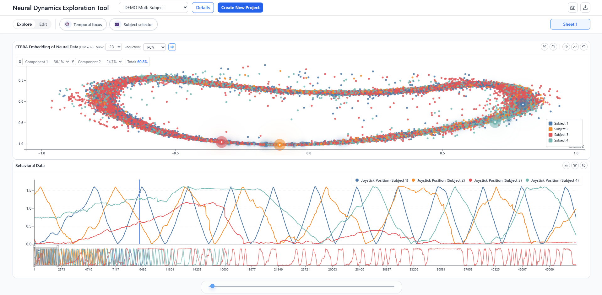

# TESSA

**Temporal Embedding and State-Space Analytics**

TESSA is a browser-based visual analytics environment for the coordinated exploration of latent representations and temporally aligned multimodal data. It links low-dimensional embedding views with synchronized time-series views so that observations can be explored in both their latent and temporal context. A FastAPI backend serves the frontend and stores projects locally.



## Overview

TESSA supports exploratory analysis of time-resolved data when latent representations need to be interpreted alongside their underlying measurements. Users can arrange embedding and time-series charts in a configurable workspace, compare subjects and projections, select observations across views, and save or export projects.

No research datasets are distributed with this repository. Users provide their own NumPy data.

## Features

- Coordinated embedding and time-series visualization with selection across views.
- PCA, t-SNE, and UMAP projections.
- DBSCAN clustering for two-dimensional scatter plots.
- Single-subject and multi-subject analysis.
- Configurable grid-based workspace and persistent local project settings.
- Project export and chart image export.

## Requirements

TESSA has been tested on macOS with Python 3.12. It also requires `pip` and a modern web browser. Backend dependencies are pinned in [`tool/backend/requirements.txt`](tool/backend/requirements.txt).

The current frontend loads D3.js and Tailwind CSS from external CDNs, so the browser needs an internet connection when loading the interface. Node.js is not required; FastAPI serves the frontend as static files.

## Installation

Clone the repository, then create a virtual environment and install the backend dependencies:

```bash
git clone https://github.com/lukasp0910/tessa-visual-analytics.git
cd tessa-visual-analytics/tool
python3.12 -m venv .venv
source .venv/bin/activate
python -m pip install -r backend/requirements.txt
```

On Windows, use `py -3.12 -m venv .venv` to create the environment. Activate it with `.venv\Scripts\Activate.ps1` in PowerShell or `.venv\Scripts\activate.bat` in Command Prompt, then run the same `python -m pip install` command. Windows has not been tested for this release.

## Running TESSA

With the environment active, start the application from `tool/`:

```bash
cd backend
uvicorn app.main:app --host 127.0.0.1 --port 8000
```

Open <http://127.0.0.1:8000/>. The same server provides the UI and API; no separate frontend build is needed. Uploaded projects and settings are stored in `tool/backend/files/`, which is excluded from Git.

## Input Data Format

TESSA accepts numerical data in `.npy` files (one NumPy array per file) and `.npz` archives (multiple named arrays). The direct project-import endpoint accepts `.npz` files. A typical feature array has shape `(n_timepoints, n_features)`: rows are observations in chronological order, and columns are variables or features.

### Single-subject data

For a single subject, no subject ID column is required. Import the arrays and keep observations in their intended time order.

### Temporal alignment

TESSA aligns arrays by **row position**, not by explicit timestamp values. Arrays intended for coordinated analysis should represent corresponding observations in the same row order and use a consistent sampling rate. Different row counts are accepted, but synchronized exploration is limited to their shared range.

### Multi-subject data

For subject-indexed arrays, place a numeric subject ID in the **first column** and preserve chronological order within each subject. The Subject Configurator lets users identify which arrays contain subject IDs. Trial IDs do not have a mandatory first-column convention in the current implementation.

No example research data are included. Compatible archives can be created with NumPy's `save`, `savez`, or `savez_compressed` functions.

## Repository Structure

```text
.
├── CITATION.cff
├── LICENSE
├── README.md
├── docs/
│   └── tessa_overview.png
└── tool/
    ├── backend/
    │   ├── app/
    │   ├── processing/
    │   ├── files/
    │   └── requirements.txt
    └── frontend/
```

Application source code remains under `tool/`. The `tool/backend/files/` directory holds runtime project data and is excluded from version control.

## Data and Privacy

The documented launch command binds the backend to `127.0.0.1`, and TESSA stores imported project data and analytical settings on the local machine. Project data are excluded from this repository. The current frontend fetches JavaScript and CSS tooling from external CDNs; assess that dependency before using TESSA in a restricted or offline environment.

## Citation

Software citation metadata are in [`CITATION.cff`](CITATION.cff), which GitHub displays through its **Cite this repository** feature. A citation to the accompanying publication can be added when publication details are available.

## Version

A manuscript-matched release is planned as `v1.0.0` once the evaluated version is finalized. No release has been tagged yet; until then, use a specific commit hash when referring to an exact version.

## License

TESSA is distributed under the [MIT License](LICENSE). Third-party packages and externally hosted frontend assets retain their own licenses.
